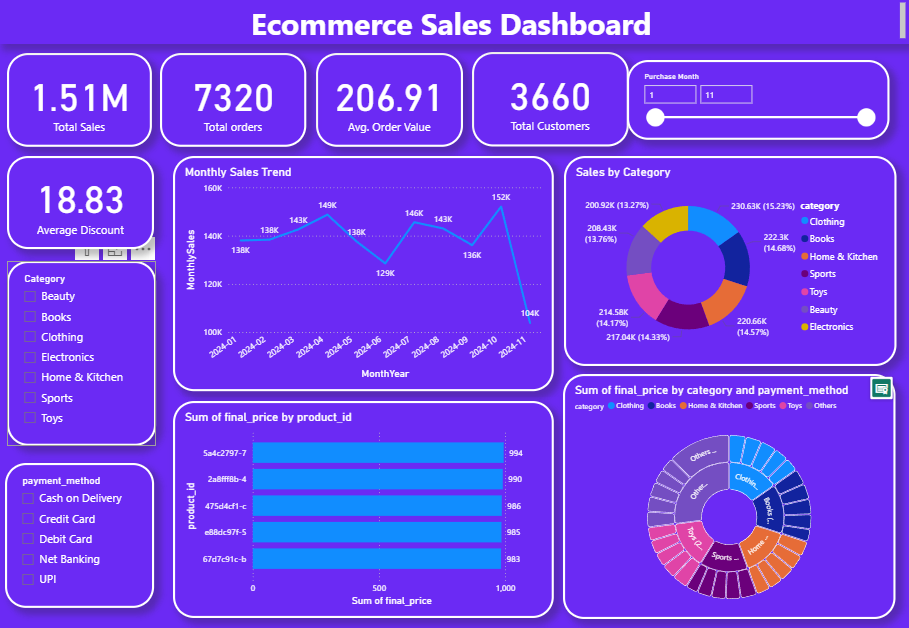

# 📊 **Ecommerce Sales Dashboard – Power BI Project**

## 🚀 **Project Overview**
This **Power BI** project showcases an **Ecommerce Sales Dashboard** built to monitor and analyze key business KPIs including total sales, customer trends, product performance, and order statistics.

> 🔍 **Goal:** Enable **data-driven decision-making** using interactive and real-time visual insights.

## 📌 **Key Features**
- 🛒 **1.51M Total Sales** and **7320 Orders**
- 📊 **Monthly Sales Trend Visualization**
- 🧾 **Category-wise Sales Breakdown**
- 💳 **Payment Method Analytics**
- 🏆 **Top Performing Products**
- 🎛️ **Interactive Filters** (Month, Category, Payment Method)
- 🎨 **Clean UI with Donut, Line, and Bar Charts**

## 🧠 **Insights Generated**
- 📈 **Peak Sales Month:** *October 2024* with **152K sales**
- 🧥 **Top Category by Revenue:** *Clothing* – **15.23%**
- 💳 **Popular Payment Methods:** UPI, Credit/Debit Card, COD, Net Banking
- 💰 **Average Order Value:** **₹206.91**
- 🔖 **Average Discount Offered:** **18.83%**

## 📂 **Files Included**
| File Name                     | Description                            |
|------------------------------|----------------------------------------|
| `sales.pbix`                 | Power BI Dashboard file                |
| `ecommerce_dataset_updated.csv` | Cleaned ecommerce dataset           |
| `query.sql`                  | SQL queries for data transformation    |
| `POSTGRES_DATA_SQL.csv`      | Raw data exported from PostgreSQL      |
| `bi.pdf`                     | PDF Report documentation               |
| `photo.png`                  | Dashboard screenshot                   |

## 🛠️ **Tools & Technologies Used**
- 🧩 **Power BI** – Data Modeling & Visualization  
- 🗃️ **PostgreSQL** – Data Querying & Extraction  
- 💾 **CSV / Excel** – Data Handling  
- 🧪 **SQL** – Data Transformation  
- 🐙 **Git & GitHub** – Version Control & Collaboration

## ▶️ **How to Use**
1. **Clone or download** this repository.
2. Open the `sales.pbix` file using **Power BI Desktop**.
3. Explore the **interactive dashboard** using slicers and filters.
4. Review the PDF report (`bi.pdf`) for summarized insights.

## 👤 **Author**
**[siddhesh chavan]**  
🎓 2nd Year Data Science Student | 📊 Power BI Enthusiast  
🔗 [View my GitHub profile]([https://github.com/yourusername](https://github.com/Siddheshchavan24))
